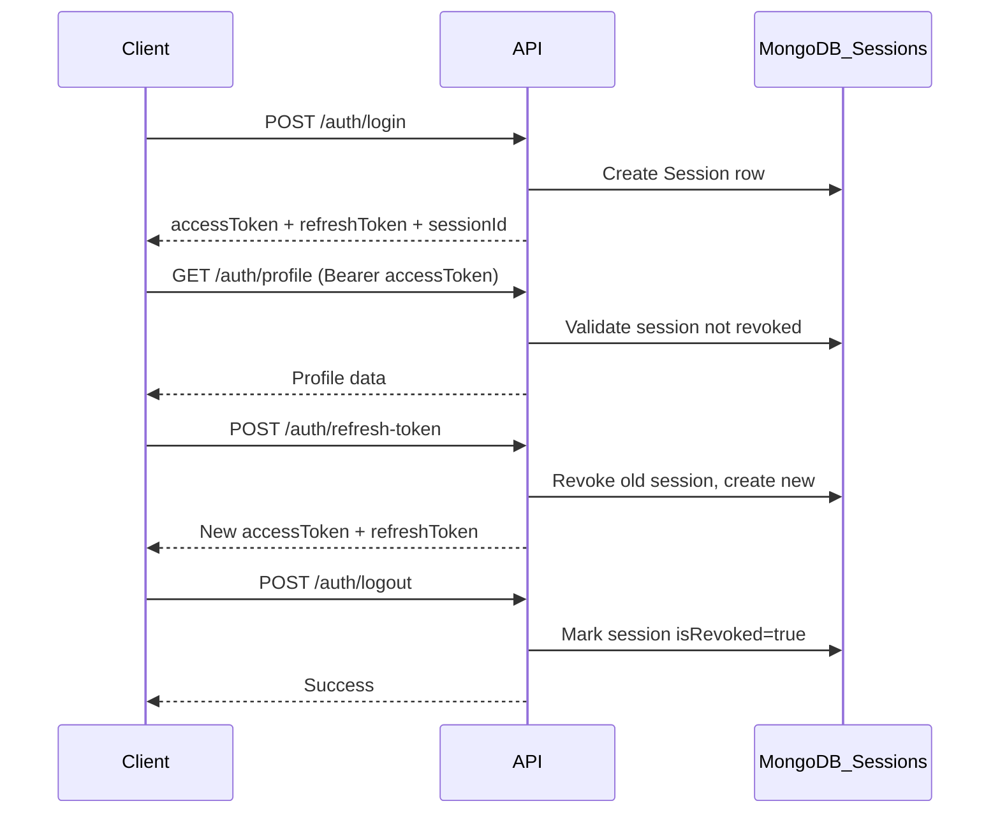

# Express.js Backend Starter Template

A production-ready **Express 5 + TypeScript + Prisma + MongoDB** API starter with JWT authentication, Zod validation, modular architecture, and built-in developer tooling.

---

## Tech Stack

| Technology | Purpose |
|------------|---------|
| [Express 5](https://expressjs.com/) | HTTP server and routing |
| [TypeScript](https://www.typescriptlang.org/) | Type-safe development |
| [Prisma](https://www.prisma.io/) | MongoDB ORM and schema management |
| [MongoDB](https://www.mongodb.com/) | Database |
| [Zod](https://zod.dev/) | Request and environment validation |
| [JWT](https://jwt.io/) | Stateless authentication |
| [bcrypt](https://www.npmjs.com/package/bcrypt) | Password hashing |
| [Nodemailer](https://nodemailer.com/) | Password reset emails |
| [Helmet](https://helmetjs.github.io/) | Security headers |
| [express-rate-limit](https://www.npmjs.com/package/express-rate-limit) | Auth route rate limiting |

---

## Features

- **JWT + Refresh Token Authentication** — access/refresh token pair with rotation on every refresh
- **MongoDB Session Management** — track active devices, IP, user agent; revoke instantly on logout
- **Remember Me (optional)** — frontend can send `rememberMe: true` on login for longer sessions
- **Session cleanup cron** — daily job removes revoked/expired sessions older than 30 days
- **Admin Session Control** — list sessions, revoke one/all/multiple users, global logout (super admin)
- **User Session Control** — view own sessions, logout current device, logout all other devices
- **Role-based access control** — `USER`, `ADMIN`, `SUPER_ADMIN`
- **User management** — registration, paginated listing, profile update, admin update
- **Super admin seeding** — auto-creates default super admin on first boot
- **Global error handling** — Zod, Prisma, and custom `ApiError` handling
- **Request validation** — Zod schemas per route
- **Pagination & search** — reusable pagination helper
- **Module generator** — scaffold new feature modules via CLI
- **File upload helper** — Multer-based disk upload utility
- **Email utility** — Gmail SMTP for password reset
- **Environment validation** — fails fast on missing required env vars
- **ESLint + Prettier** — linting and formatting out of the box

---

## Folder Structure

```
expressjs-backend-starter-template/
├── prisma/
│   └── schema.prisma          # Database schema (User model, enums)
├── src/
│   ├── app.ts                 # Express app setup (middleware, routes)
│   ├── server.ts              # HTTP server bootstrap + graceful shutdown
│   ├── generate-module.ts     # CLI to scaffold new modules
│   ├── config/
│   │   └── index.ts           # Environment config with Zod validation
│   ├── app/
│   │   ├── db/
│   │   │   └── db.ts          # Super admin seed on startup
│   │   ├── middlewares/
│   │   │   ├── auth.ts        # JWT + role-based auth middleware
│   │   │   ├── globalErrorHandler.ts
│   │   │   └── validateRequest.ts
│   │   ├── modules/
│   │   │   ├── Auth/          # Login, refresh, logout, password flows
│   │   │   ├── Session/       # Admin session lookup and revocation
│   │   │   └── User/          # Registration, listing, updates
│   │   └── routes/
│   │       └── index.ts       # Aggregates all module routes under /api/v1
│   ├── errors/                # ApiError, Zod/Prisma error parsers
│   ├── helpers/               # jwtHelpers, tokenHasher, sessionHelper, paginationHelper
│   ├── interfaces/            # TypeScript interfaces and Express augmentation
│   └── shared/                # catchAsync, sendResponse, pick, prisma client
├── public/
│   └── reset-password.html    # Standalone reset password page (dev/testing)
├── postman/
│   ├── Express-Backend-Starter.postman_collection.json
│   └── local.postman_environment.json
├── .env.example               # Environment variable template
├── eslint.config.mjs          # ESLint flat config
├── tsconfig.json
├── vercel.json                # Vercel deployment config
└── package.json
```

---

## Prerequisites

- **Node.js** 20 or higher
- **MongoDB** — local instance or [MongoDB Atlas](https://www.mongodb.com/atlas)
- **Gmail App Password** (optional) — for password reset emails via Nodemailer

---

## Installation

### Step 1: Clone the repository

```bash
git clone <your-repo-url>
cd expressjs-backend-starter-template
```

### Step 2: Install dependencies

```bash
npm install
```

This also runs `prisma generate` automatically via the `postinstall` script.

### Step 3: Configure environment variables

```bash
cp .env.example .env
```

Open `.env` and fill in your values. At minimum you need:

```env
DATABASE_URL="mongodb://localhost:27017/your-db-name"
JWT_SECRET=your_strong_secret_here
REFRESH_TOKEN_SECRET=your_refresh_secret_here
RESET_PASS_TOKEN=your_reset_secret_here
```

See the [Environment Variables](#environment-variables) section for the full list.

### Step 4: Set up MongoDB (replica set required)

Prisma requires MongoDB to run as a **replica set** for write operations. For local development:

```bash
# Start MongoDB with replica set (adjust path for your install)
mongod --replSet rs0 --port 27017 --dbpath /data/db

# In mongosh, initialize the replica set (run once)
rs.initiate()
```

Alternatively, use [MongoDB Atlas](https://www.mongodb.com/atlas) which provides replica sets by default.

### Step 5: Push the database schema

```bash
npm run dbPush
```

This syncs the Prisma schema to your MongoDB database.

### Step 6: Start the development server

```bash
npm run dev
```

The server starts at `http://localhost:5500` (or your configured `PORT`).

### Step 7: Verify the server is running

```bash
curl http://localhost:5500/
```

Expected response:

```json
{
  "success": true,
  "statusCode": 200,
  "message": "Welcome to Express Backend Starter!"
}
```

---

## Environment Variables

| Variable | Required | Default | Description |
|----------|----------|---------|-------------|
| `NODE_ENV` | No | `development` | Runtime environment |
| `PORT` | No | `5500` | Server port |
| `DATABASE_URL` | **Yes** | — | MongoDB connection string |
| `BCRYPT_SALT_ROUNDS` | No | `12` | bcrypt hashing rounds |
| `CORS_ORIGIN` | No | `http://localhost:3000,http://localhost:3001` | Comma-separated allowed origins |
| `JWT_SECRET` | **Yes** | — | Access token signing secret |
| `EXPIRES_IN` | No | `1d` | Access token expiry |
| `REFRESH_TOKEN_SECRET` | **Yes** | — | Refresh token signing secret |
| `REFRESH_TOKEN_EXPIRES_IN` | No | `1d` | Refresh token / session expiry (when `rememberMe` is false or omitted) |
| `REMEMBER_ME_EXPIRES_IN` | No | `30d` | Session expiry when login includes `rememberMe: true` |
| `SESSION_CLEANUP_CRON` | No | `0 3 * * *` | Cron schedule for deleting old revoked/expired sessions |
| `SESSION_CLEANUP_RETENTION_DAYS` | No | `30` | Delete sessions older than this many days (revoked or expired only) |
| `RESET_PASS_TOKEN` | **Yes** | — | Password reset token secret |
| `RESET_PASS_TOKEN_EXPIRES_IN` | No | `10m` | Reset token expiry |
| `RESET_PASS_LINK` | No | `http://localhost:5500/reset-password` | Reset password page URL |
| `EMAIL` | No | — | Gmail address for sending emails |
| `APP_PASS` | No | — | Gmail app password |
| `SUPER_ADMIN_EMAIL` | No | `admin@gmail.com` | Default super admin email |
| `SUPER_ADMIN_PASSWORD` | No | `12345678` | Default super admin password |
| `SUPER_ADMIN_FIRST_NAME` | No | `Mr. Super` | Super admin first name |
| `SUPER_ADMIN_LAST_NAME` | No | `Admin` | Super admin last name |
| `SUPER_ADMIN_USERNAME` | No | `admin` | Super admin username |
| `SUPER_ADMIN_PHONE` | No | `0112345678` | Super admin phone |

**Session & remember-me example** (add to your `.env`):

```env
REFRESH_TOKEN_EXPIRES_IN=1d
REMEMBER_ME_EXPIRES_IN=30d
SESSION_CLEANUP_CRON=0 3 * * *
SESSION_CLEANUP_RETENTION_DAYS=30
```

---

## Available Scripts

| Script | Command | Description |
|--------|---------|-------------|
| `dev` | `npm run dev` | Start dev server with hot reload (tsx) |
| `build` | `npm run build` | Compile TypeScript to `dist/` |
| `start` | `npm start` | Run compiled production build |
| `dbPush` | `npm run dbPush` | Push Prisma schema to MongoDB |
| `generate` | `npm run generate Product` | Scaffold a new module |
| `typecheck` | `npm run typecheck` | TypeScript type checking |
| `lint` | `npm run lint` | Run ESLint |
| `lint:fix` | `npm run lint:fix` | Auto-fix ESLint issues |
| `format` | `npm run format` | Format code with Prettier |

---

## Authentication Architecture



- **Access token** — JWT containing `sessionId`; expiry set by `EXPIRES_IN` (default `1d`); validated on every protected request
- **Refresh token** — opaque token; SHA-256 hashed in DB; rotated on each refresh; session length is `REFRESH_TOKEN_EXPIRES_IN` (default `1d`) or `REMEMBER_ME_EXPIRES_IN` (default `30d`) when login sends `rememberMe: true`
- **Session row** — tracks device, IP, user agent, and `rememberMe`; revocation is immediate (no waiting for token expiry)
- **Cleanup cron** — `SESSION_CLEANUP_CRON` (default `0 3 * * *`) deletes revoked/expired sessions older than `SESSION_CLEANUP_RETENTION_DAYS` (default `30`)

---

## API Reference

All API routes are prefixed with `/api/v1`.

### Authentication

```
Authorization: Bearer <accessToken>
```

| Method | Endpoint | Auth | Description |
|--------|----------|------|-------------|
| `POST` | `/auth/login` | No | Login; returns access + refresh tokens |
| `POST` | `/auth/refresh-token` | No | Rotate refresh token, get new access token |
| `POST` | `/auth/logout` | Yes | Revoke current session |
| `POST` | `/auth/logout-all` | Yes | Revoke all sessions except current |
| `GET` | `/auth/sessions` | Yes | List own active sessions |
| `GET` | `/auth/profile` | User, Admin, Super Admin | Get logged-in user profile |
| `PUT` | `/auth/change-password` | Yes | Change password (revokes other sessions) |
| `POST` | `/auth/forgot-password` | No | Send password reset email |
| `POST` | `/auth/reset-password` | Reset token in header | Reset password (revokes all sessions) |

#### Login

```bash
curl -X POST http://localhost:5500/api/v1/auth/login \
  -H "Content-Type: application/json" \
  -d '{"email":"admin@gmail.com","password":"12345678","rememberMe":true}'
```

`rememberMe` is **optional**. Omit it or send `false` for a short-lived session (`REFRESH_TOKEN_EXPIRES_IN`, default `1d`). Send `true` for a longer session (`REMEMBER_ME_EXPIRES_IN`, default `30d`). The access token expiry (`EXPIRES_IN`) is unchanged either way.

Response:

```json
{
  "success": true,
  "message": "User logged in successfully",
  "data": {
    "accessToken": "eyJhbGciOiJIUzI1NiIs...",
    "refreshToken": "a1b2c3...",
    "sessionId": "uuid-here",
    "expiresIn": "1d",
    "rememberMe": true,
    "sessionExpiresIn": "30d"
  }
}
```

#### Refresh Token

```bash
curl -X POST http://localhost:5500/api/v1/auth/refresh-token \
  -H "Content-Type: application/json" \
  -d '{"refreshToken":"<refresh_token>"}'
```

#### Get Profile

```bash
curl http://localhost:5500/api/v1/auth/profile \
  -H "Authorization: Bearer <accessToken>"
```

### Session Management (Admin)

| Method | Endpoint | Auth | Description |
|--------|----------|------|-------------|
| `GET` | `/sessions` | Admin, Super Admin | List all active sessions (paginated) |
| `GET` | `/sessions/:sessionId` | Admin, Super Admin | Get session detail |
| `DELETE` | `/sessions/:sessionId` | Admin, Super Admin | Revoke one session |
| `DELETE` | `/sessions/user/:userId` | Admin, Super Admin | Revoke all sessions for a user |
| `POST` | `/sessions/revoke-users` | Admin, Super Admin | Revoke sessions for multiple users |
| `DELETE` | `/sessions` | Super Admin only | Revoke all sessions globally |

### Session Cleanup Cron

On server start, a background cron job runs on the schedule in `SESSION_CLEANUP_CRON` (default: daily at 3:00 AM). It permanently deletes session records that are **both**:

1. Older than `SESSION_CLEANUP_RETENTION_DAYS` (default 30 days), **and**
2. Either revoked (`isRevoked: true`) or past their `expiresAt` date

Active, non-expired sessions are never deleted by this job.

#### Revoke Multiple Users

```bash
curl -X POST http://localhost:5500/api/v1/sessions/revoke-users \
  -H "Authorization: Bearer <admin_accessToken>" \
  -H "Content-Type: application/json" \
  -d '{"userIds":["user-id-1","user-id-2"]}'
```

### Users

| Method | Endpoint | Auth | Description |
|--------|----------|------|-------------|
| `POST` | `/users/register` | No | Register a new user |
| `GET` | `/users` | Admin, Super Admin | List users (paginated, searchable) |
| `PUT` | `/users/profile` | User, Admin | Update own profile |
| `PUT` | `/users/:id` | Admin, Super Admin | Update any user by ID |

#### Register User

```bash
curl -X POST http://localhost:5500/api/v1/users/register \
  -H "Content-Type: application/json" \
  -d '{
    "firstName": "John",
    "lastName": "Doe",
    "username": "johndoe",
    "email": "john@example.com",
    "phone": "0123456789",
    "password": "password123"
  }'
```

#### List Users (Admin)

```bash
curl "http://localhost:5500/api/v1/users?page=1&limit=10&searchTerm=john" \
  -H "Authorization: Bearer <admin_token>"
```

Query parameters: `page`, `limit`, `sortBy`, `sortOrder`, `searchTerm`, `role`, `email`.

---

## Default Super Admin

On first database connection, a super admin is seeded automatically if one does not exist.

Default credentials (configurable via `.env`):

| Field | Default |
|-------|---------|
| Email | `admin@gmail.com` |
| Password | `12345678` |

Change these in production by setting `SUPER_ADMIN_EMAIL` and `SUPER_ADMIN_PASSWORD` in your `.env` before the first boot.

---

## Creating New Modules

Scaffold a new feature module:

```bash
npm run generate Product
```

This creates:

```
src/app/modules/Product/
├── Product.controller.ts
├── Product.service.ts
├── Product.routes.ts
├── Product.validation.ts
└── Product.interface.ts
```

Then register the routes in `src/app/routes/index.ts`:

```typescript
import { ProductRoutes } from '../modules/Product/Product.routes';

const moduleRoutes = [
  // ...existing routes
  {
    path: '/products',
    route: ProductRoutes,
  },
];
```

---

## Utilities Reference

| Utility | Location | Purpose |
|---------|----------|---------|
| `catchAsync` | `src/shared/catchAsync.ts` | Wraps async controllers, forwards errors to Express error handler |
| `sendResponse` | `src/shared/sendResponse.ts` | Standardized JSON response `{ success, message, meta?, data }` |
| `pick` | `src/shared/pick.ts` | Pick specific keys from an object (used for query filters) |
| `paginationHelper` | `src/helpers/paginationHelper.ts` | Calculate page, limit, skip for offset pagination |
| `jwtHelpers` | `src/helpers/jwtHelpers.ts` | Access token generation and verification |
| `tokenHasher` | `src/helpers/tokenHasher.ts` | SHA-256 hash and generate refresh tokens |
| `sessionHelper` | `src/helpers/sessionHelper.ts` | Extract IP/userAgent from request; parse expiry |
| `validateRequest` | `src/app/middlewares/validateRequest.ts` | Zod schema middleware for `req.body` |
| `ApiError` | `src/errors/ApiErrors.ts` | Custom error class with HTTP status code |
| `fileUploader` | `src/helpers/fileUploader.ts` | Multer disk upload for `profileImage` and generic files |
| `auth` | `src/app/middlewares/auth.ts` | JWT verification + optional role guard |

---

## Reset Password Page

For development and testing without a frontend:

```
http://localhost:5500/reset-password?token=<reset_token>&userId=<user_id>
```

1. Call `POST /api/v1/auth/forgot-password` with an email
2. Copy the `token` from the email link (or generate manually)
3. Open the URL above in a browser
4. Submit the new password — it calls the same API your frontend will use

Set `RESET_PASS_LINK=http://localhost:5500/reset-password` in `.env` so email links point here during development.

---

## Postman Collection

Import these files into [Postman](https://www.postman.com/):

1. `postman/Express-Backend-Starter.postman_collection.json`
2. `postman/local.postman_environment.json`

**Quick start:**

1. Select the **Express Backend - Local** environment
2. Run **Auth > Login (Admin - Remember Me)** or **Login (Admin - Standard)** — tokens are saved automatically
3. Run any other request — they use `{{accessToken}}` automatically

**Login requests:**

| Request | Body | Session length |
|---------|------|----------------|
| Login (Admin - Remember Me) | `"rememberMe": true` | `REMEMBER_ME_EXPIRES_IN` (default `30d`) |
| Login (Admin - Standard) | no `rememberMe` field | `REFRESH_TOKEN_EXPIRES_IN` (default `1d`) |
| Login (User) | no `rememberMe` field | `REFRESH_TOKEN_EXPIRES_IN` |

After login, the test script saves `accessToken`, `refreshToken`, `sessionId`, `rememberMe`, and `sessionExpiresIn` to the environment.

Environment variables: `baseUrl`, `accessToken`, `refreshToken`, `sessionId`, `rememberMe`, `sessionExpiresIn`, `userId`, `adminEmail`, `adminPassword`.

---

## Recommended Future Utilities

These are not implemented yet but are worth adding as your project grows:

| Utility | Why | How to add |
|---------|-----|------------|
| `GET /health` | Load balancer / uptime checks | Route returning DB connection status |
| Request ID middleware | Trace logs across requests | `uuid` middleware attaching `req.id` |
| Structured logger (Pino) | Replace `console.log` in production | `pino` + `pino-http` |
| OpenAPI/Swagger | Auto API docs for frontend teams | `swagger-jsdoc` + `/api-docs` route |
| Audit log model | Track admin session revokes | `AuditLog` Prisma model + middleware |
| Redis session cache | Faster session lookups at scale | Cache `sessionId → valid` with TTL |
| Email queue (BullMQ) | Non-blocking password reset emails | Queue `emailSender` jobs |
| API idempotency keys | Safe retries on POST | `Idempotency-Key` header middleware |

---

## Deployment (Vercel)

1. Build the project:

   ```bash
   npm run build
   ```

2. Set all environment variables in the Vercel dashboard (same as `.env.example`).

3. Deploy. The `vercel.json` rewrites all routes to `dist/server.js`.

For other platforms, run `npm run build` then `npm start`.

---

## Extending the Template

### Add Stripe Payments

```bash
npm install stripe
```

Create `src/app/modules/Payment/` and use the [Stripe Node SDK](https://stripe.com/docs/api). Store `STRIPE_SECRET_KEY` in `.env`.

### Add Socket.io (Real-time)

```bash
npm install socket.io
```

Attach Socket.io to the HTTP server in `src/server.ts` and create an event module under `src/app/modules/`.

### Add Cloudinary (Image Upload)

```bash
npm install cloudinary
```

Replace or extend `src/helpers/fileUploader.ts` to upload to Cloudinary instead of local disk.

---

## License

ISC
